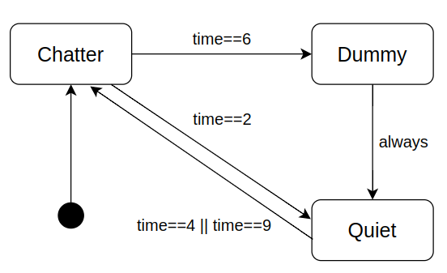

# Finite State Machine




Setup
```
poetry install
```

How to run
```
poetry run python finite_state_machine/main.py
```

output
```
===== Start FiniteStateMachine =====
ChatterState is initialized
FiniteStateMachine is initialized with ChatterState
=====Update FiniteStateMachine 0 =====
[Action] Hello
[Action] State Chatter!!!
=====Update FiniteStateMachine 1 =====
[Action] Hello
[Action] State Chatter!!!
=====Update FiniteStateMachine 2 =====
QuietState is initialized
[Action] Exit Chatter!!!
[Action] Transition from Chatter!!!
[Action] Entry Quiet...
=====Update FiniteStateMachine 3 =====
[Action] State Quiet...
=====Update FiniteStateMachine 4 =====
ChatterState is initialized
[Action] Exit Quiet...
[Action] Transition from Quiet...
[Action] Entry Chatter!!!
=====Update FiniteStateMachine 5 =====
[Action] Hello
[Action] State Chatter!!!
=====Update FiniteStateMachine 6 =====
DummyState is initialized
[Action] Exit Chatter!!!
[Action] Transition from Chatter!!!
[Action] Entry Dummy
=====Update FiniteStateMachine 7 =====
QuietState is initialized
[Action] Exit Dummy
[Action] Transition from Dummy
[Action] Entry Quiet...
=====Update FiniteStateMachine 8 =====
ChatterState is initialized
[Action] Exit Quiet...
[Action] Transition from Quiet...
[Action] Entry Chatter!!!
=====Update FiniteStateMachine 9 =====
[Action] Hello
[Action] State Chatter!!!
===== Finish FiniteStateMachine =====

```


### Reference
- [AI for Games, Third Edition]
(https://www.oreilly.com/library/view/ai-for-games/9781351053280/)
